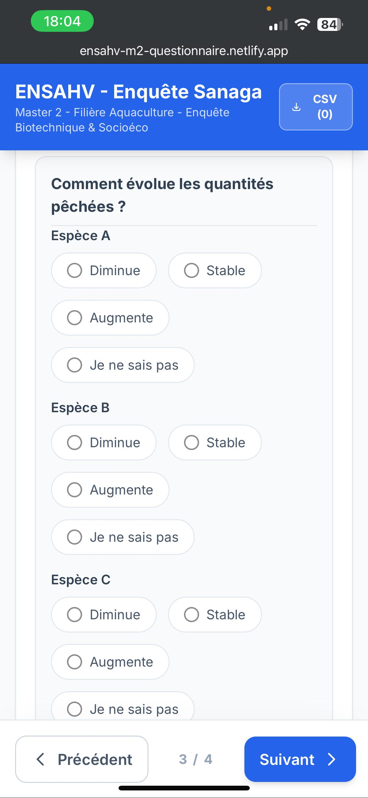

# ENSAHV M2 Survey Application

> A professional web-based survey application for biotechnical and socio-economic data collection in fisheries research.

## Table of Contents
- [ENSAHV M2 Survey Application](#ensahv-m2-survey-application)
  - [Table of Contents](#table-of-contents)
  - [Overview](#overview)
  - [Features](#features)
  - [Technology Stack](#technology-stack)
  - [Prerequisites](#prerequisites)
  - [Installation](#installation)
    - [Option 1: Using npm (Recommended)](#option-1-using-npm-recommended)
  - [Usage](#usage)
    - [Running the Development Server](#running-the-development-server)
    - [Building for Production](#building-for-production)
  - [Deployment](#deployment)
    - [Deploying to Netlify (Recommended)](#deploying-to-netlify-recommended)
    - [Other Deployment Options](#other-deployment-options)
  - [Data Export](#data-export)
    - [CSV Export Features](#csv-export-features)
    - [Data Management](#data-management)
  - [Citation](#citation)
  - [Author](#author)
  - [License](#license)
  - [Support](#support)


## Overview

This is a comprehensive survey application developed for Master 2 students at ENSAHV (École Nationale Supérieure d'Agriculture de la Vallée) to conduct structured interviews and data collection for biotechnical and socio-economic research on fisheries in the Sanaga region.

**Live Demo:** [ensahv-m2-questionnaire.netlify.app](https://ensahv-m2-questionnaire.netlify.app/)

<p align="center">
  
  
  
</p>

## Features

- **Progressive Survey Workflow** - Multi-section form with smooth navigation between sections
- **Offline-First Design** - Works without internet connection; saves drafts locally
- **GPS Integration** - Automatic location capture for survey respondents
- **Data Persistence** - Local storage of survey data with automatic draft saving
- **CSV Export** - Export all collected data to CSV format with proper UTF-8 encoding
- **Data Management** - Clear/reset functionality with confirmation dialogs
- **Responsive Design** - Optimized for mobile, tablet, and desktop use
- **PWA Support** - Progressive Web App manifest for installation on mobile devices
- **Accessibility** - Semantic HTML and WCAG-compliant interactive components

## Technology Stack

- **Frontend Framework** - React 19
- **Build Tool** - Vite
- **Styling** - Tailwind CSS
- **Language** - TypeScript
- **Runtime** - Node.js
- **Hosting** - Netlify


## Prerequisites

Before you begin, ensure you have the following installed on your system:

- **Node.js** (v16 or higher) - [Download here](https://nodejs.org/)
- **npm** (v8 or higher) - Comes with Node.js
- **Git** - [Download here](https://git-scm.com/) (optional, for cloning the repository)

To verify your installation:
```bash
node --version
npm --version
```

## Installation

### Option 1: Using npm (Recommended)

1. **Clone the repository** (if you haven't already):
   ```bash
   git clone https://github.com/fiastros/ensahv-tools-survey.git
   cd survey-app
   ```

2. **Install dependencies**:
   ```bash
   npm install
   ```


## Usage

### Running the Development Server

Start the development server for local testing:

```bash
npm run dev
```

The application will be available at `http://localhost:5173` (default Vite port). The server includes hot module reloading, so changes are reflected immediately.

### Building for Production

Create an optimized production build:

```bash
npm run build
```

This command:
- Compiles TypeScript to JavaScript
- Bundles and minifies the application
- Optimizes assets
- Outputs the production build to the `/dist` folder

The build process generates static files ready for deployment.


## Deployment

### Deploying to Netlify (Recommended)

1. **Build the application**:
   ```bash
   npm run build
   ```

2. **Upload the `/dist` folder** to Netlify:
   - Drag and drop the `/dist` folder to Netlify
   - Or connect your GitHub repository for automatic deployments

3. **Configure build settings** (if deploying from Git):
   - Build command: `npm run build`
   - Publish directory: `dist`

### Other Deployment Options

You can also deploy the `/dist` folder to:
- **Vercel** - Optimal for React applications
- **GitHub Pages** - Free static hosting
- **AWS S3** + CloudFront
- **Any static hosting provider**

## Data Export

### CSV Export Features

- **Automatic Headers** - Column names are extracted from the first data entry
- **UTF-8 Encoding** - Proper character encoding for special characters (é, à, ç, etc.)
- **Quote Escaping** - Handles quotes and special characters in cell values
- **Timestamp Naming** - CSV files are automatically named with the export date
- **Excluded Fields** - The following fields are excluded from the export: `tranche_age`, `region_origine`, `nom_local_existe`, `noms_locaux`

### Data Management

- **Export Data** - Click "Exportez les données" to download collected data as CSV
- **Clear Data** - Click "Effacer les données" to permanently delete all stored survey data (requires confirmation)
- **Draft Recovery** - Survey drafts are automatically saved and restored on reload


## Citation

If you use this application in your research, academic work, or any other project, please cite it as follows:

**APA Format:**
```
EYANGO TABI, T. G. L. (2026). ENSAHV M2 Survey Application. Retrieved from https://github.com/fiastros/ensahvtoolssurvey
```

**BibTeX Format:**
```bibtex
@software{ensahv2026,
  author = {EYANGO TABI, Theophile G. Loic},
  title = {ENSAHV M2 Survey Application},
  year = {2026},
  url = {https://github.com/fiastros/ensahvtoolssurvey}
}
```

**Chicago Format:**
```
EYANGO TABI, Theophile G. Loic. "ENSAHV M2 Survey Application." Accessed 2026. https://github.com/fiastros/ensahvtoolssurvey
```

## Author

**Dr. EYANGO TABI, Theophile G. Loic**
- Department of Aquaculture
- ENSAHV University of Douala, Cameroon
- Expertise: Machine Learning, Deep Learning, Computer Science, Uncertainty Quantification

## License

This project is provided for educational and research purposes. Attribution to the author is required for any use of this software or its derivatives.

## Support

For issues, feature requests, or questions, please open an issue on the [GitHub repository](https://github.com/fiastros/ensahv-tools-survey/issues).

---

**Last Updated:** February 2026 
